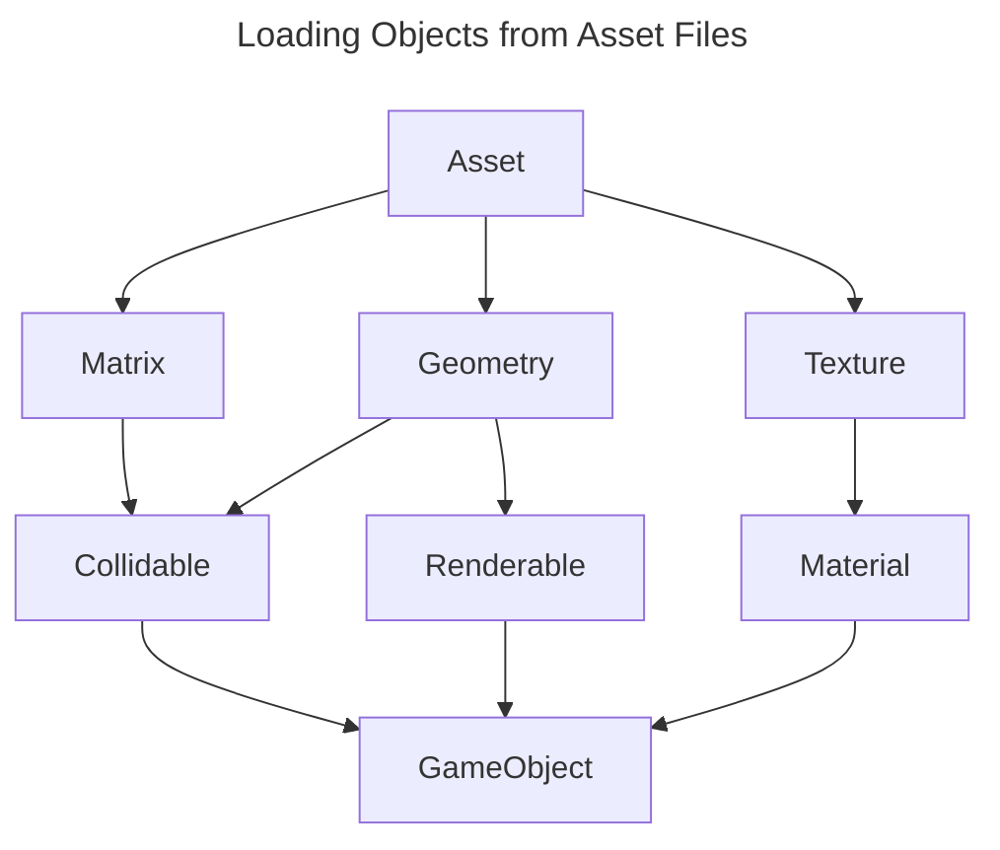

# GameEngine


A hobby real-time 3D simulation with physics, user input, and graphics.


Getting Started
---

Download the project using git.

```sh
git clone https://github.com/stickyfingies/gengine.git
chmod +x ./build.sh
```

Build the project to create an executable.

```sh
./build.sh
```

Finally, launch the app!

```sh
./dist/bin/gengine
```

#### Build Script Options

- `-i` or `--install` will forcefully re-install dependencies.
- `-w` or `--watch` automatigally compiles C++ files when they change.

Architecture
---



Gengine uses the [Asset Importer Library](https://assimp.org/) to pull geometry and texture data from static asset files.

The geometry is passed into the physics engine to create a physically simulable representation of that shape.

The geometry and the texture are passed into the rendering engine to create a structure that can be rendered on the GPU.

Finally, the culmination of these are used to create a cohesive "game object" that is both visible and tangible.

## Resources
- [Learn OpenGL](https://learnopengl.com/) <small>**Start here** — this tutorial taught me C++. It's that good.</small>
- [Vulkan Tutorial](https://vulkan-tutorial.com/)
- [Vulkan Guide - Resources](https://vkguide.dev/docs/great_resources)
- [Writing an efficient Vulkan renderer](https://zeux.io/2020/02/27/writing-an-efficient-vulkan-renderer/)
- [Interleaved or Separate Vertex Buffers](https://www.reddit.com/r/vulkan/comments/rtpdvu/interleaved_vs_separate_vertex_buffers/)

## Todo
- [x] Resizable windows
- [x] Colors and Textures
- [ ] Separate vertex positions from the other buffer data