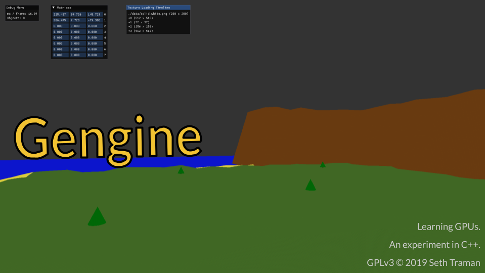
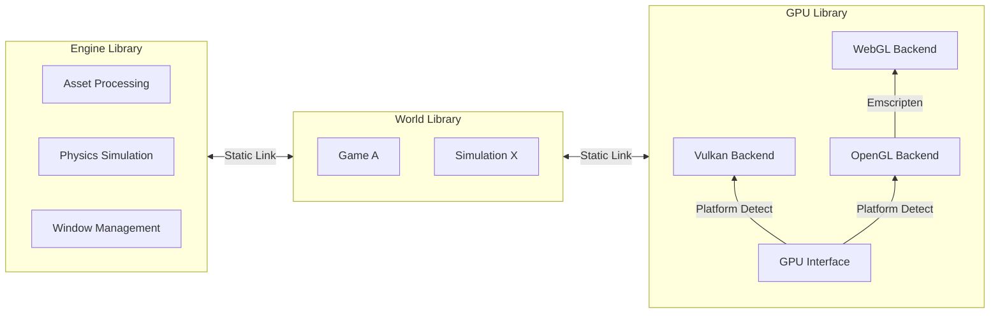
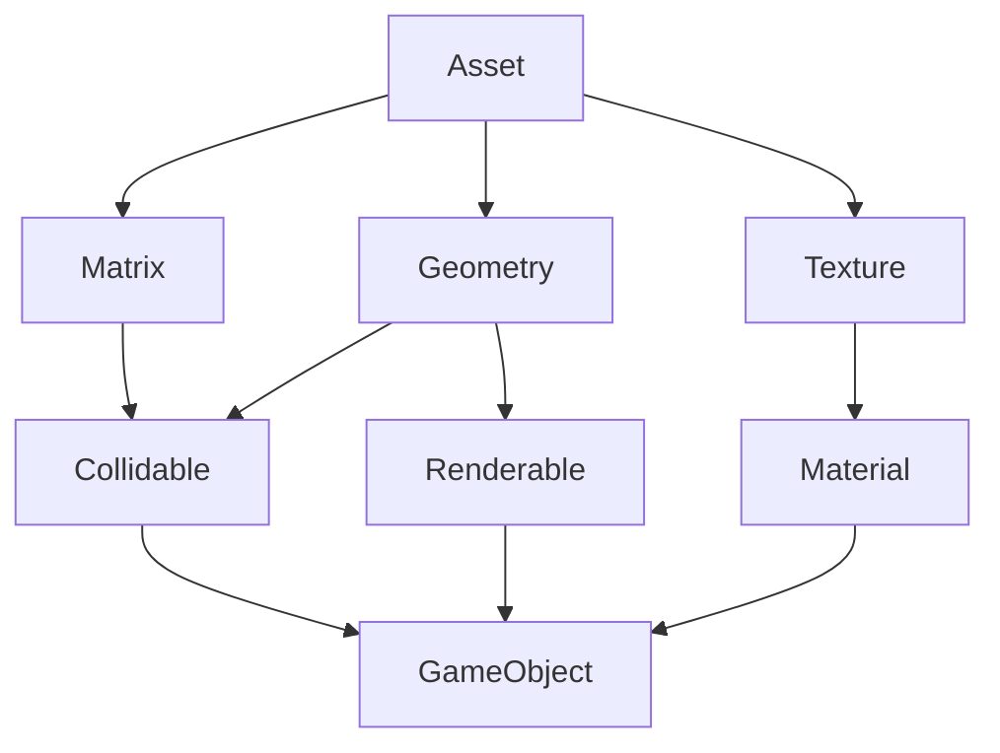

> Copyright (c) 2019 Seth Traman as [GPLv3](./COPYING).

---

Gengine is a software framework for making cross-platform video games in the C++ language.  It's named after "Game Engine". 


This project is proud of the following features:
- **Adaptive** GPU backend runs on Vulkan, OpenGL ES, and WebGL
- **Automated** the software lifecycle using CI/CD pipelines
- **Performant** virtual worlds powered by Bullet³ physics
- **Supported** platforms are desktop Linux and the Web.

<!-- Play or Download
---

[**Try it online**](https://stickyfingies.github.io/gengine/gengine.html) using a web browser.

[**Download for x64 Linux**](https://github.com/stickyfingies/gengine/releases/download/master/linux-vk-app.zip) using the instructions below.
1. Download the .zip
2. Extract (`unzip linux-vk-app.zip`).
3. Run (`./bin/world.native.bin`) to play. 

Other platforms aren't supported yet.

-->

## Let's Get Coding

#### Minimum Required Environment

Building gengine requires a sane Linux environment (git, zip, curl, etc.) in addition to the following system packages for building the application:
- cmake
- g++-13

#### Setup the Environment

1. **Clone** the git repository.
    ```sh
    git clone https://github.com/stickyfingies/gengine.git
    ```

2. **Setup** the local dev-env and build dependencies from source code.
    ```sh
    cd gengine
    chmod +x setup.sh
    sh setup.sh
    ```

#### Build the Application

Build the game engine application from source code.

```sh
cmake --workflow --preset $target
```

Desktop targets:
- `linux-vk-dev` — desktop vulkan development
- `linux-gl-dev` — desktop opengl development
- `linux-vk-app` — desktop vulkan release
- `linux-gl-app` — desktop opengl release

Browser targets:
- `web-gl-dev` — browser webgl development
- `web-gl-app` — browser webgl release

#### Run the Application

- On the **desktop** with:

    ```sh
    ./artifacts/${target}/gengine
    ```
- In the **browser** with:
    ```sh
    cd ./artifacts/web-gl-app
    python3 -m http.server
    ```
    Visit the printed URL on your favorite browser to play the game.

What's Inside
---

| Technology | Description |
| ---------- | ----------- |
|  | A general-purpose programming language that can be expressive and performant or demonic and crude. |
|  | A compilation target that enables native applications to run inside the web browser. Emscripten is the tool this project uses for compiling C++ into WebAssembly. |
|  | A meta build system that consumes high-level descriptions of your C++ project and produces scripts that compile, link, and package the app.|
|  | A Microsoft product that integrates with CMake to download and build C++ dependencies. |
|  | A cloud automation utility that reactively compiles, packages, and releases your code after pushing changes to git. |
|  | An extremely low-level GPU interface designed by Khronos Group, this powers the Linux release of Game Engine.|
|  | An older and simpler GPU interface from before graphics cards were even programmable, runs on Linux and Web. |
|  | A GPU interface for web browsers, similar to OpenGL.  Emscripten will automatically convert OpenGL code into WebGL, which is pretty freaking awesome. |
|  | A customizable physics engine that supports complex 3D shapes and provides the base for complex spatial logic. |

Diagrams!!!
---

**Compilation Strategy:**



**Loading Objects from Asset Files:**

> Note: the figure below may be outdated.



Gengine uses the [Asset Importer Library](https://assimp.org/) to pull geometry and texture data from static asset files.

The geometry is passed into the physics engine to create a physically simulable representation of that shape.

The geometry and the texture are passed into the rendering engine to create a structure that can be rendered on the GPU.

Finally, the culmination of these are used to create a cohesive "game object" that is both visible and tangible.

## Resources

C++
- [Modern C++ DevOps](https://moderncppdevops.com/)
- [DevLog - Molecule Game Engine](https://blog.molecular-matters.com/)
- [DevLog - Autodesk Stingray / BitSquid Engine](http://bitsquid.blogspot.com/)
- [DevLog - Our Machinery Engine](https://ruby0x1.github.io/machinery_blog_archive/)

Rendering
- [Learn OpenGL](https://learnopengl.com/) <small>**Start here** — this tutorial taught me C++. It's that good.</small>
- [Vulkan Tutorial](https://vulkan-tutorial.com/)
- [Vulkan Guide - Resources](https://vkguide.dev/docs/great_resources)
- [Writing an efficient Vulkan renderer](https://zeux.io/2020/02/27/writing-an-efficient-vulkan-renderer/)
- [Interleaved or Separate Vertex Buffers](https://www.reddit.com/r/vulkan/comments/rtpdvu/interleaved_vs_separate_vertex_buffers/)

Dependencies
---

All software dependencies are installed and managed by [vcpkg](https://vcpkg.io/).

- [glfw3](https://www.glfw.org/): cross-platform window creation and input
- [bullet3](https://pybullet.org/wordpress/): physics simulation for video games
- [assimp](http://assimp.org/): load and parse various 3d file formats
- [glm](https://github.com/g-truc/glm): mathematics library for graphics software
- [stb](https://github.com/nothings/stb): image loading & decoding from files and memory
- [imgui](https://github.com/ocornut/imgui): bloat-free graphical user interface for C++

Roadmap
---

- [x] Resizable windows
- [x] Colors and Textures
- [x] Texture mip-mapping
- [x] Integrate a GUI
- [ ] Lighting
- [ ] Edit, save, and load scenes
- [ ] Benchmarks and performance stats

License
---
Copyright (c) 2019 Seth Traman.

GPLv3.  See [COPYING](./COPYING).