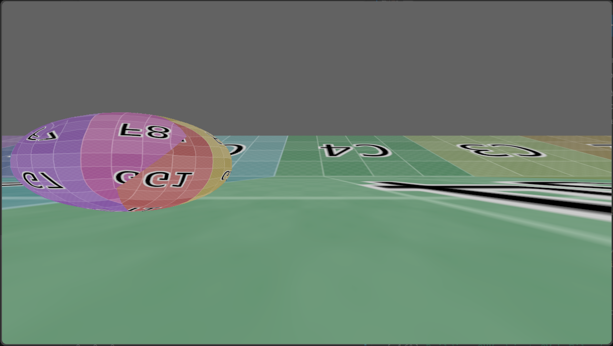

# GameEngine


A hobby real-time 3D simulation with physics, user input, and graphics.



Getting Started
---

Download the project using git.

```sh
git clone https://github.com/stickyfingies/gengine.git
chmod +x ./build.sh
```

Build the project to create an executable.

```sh
./build.sh
```

Finally, launch the app!

```sh
./dist/bin/gengine
```

#### Build Script Options

- `-i` or `--install` will forcefully re-install dependencies.
- `-w` or `--watch` automatigally compiles C++ files when they change.

## Resources
- [Vulkan Tutorial](https://vulkan-tutorial.com/)
- [Vulkan Guide - Resources](https://vkguide.dev/docs/great_resources)
- [Writing an efficient Vulkan renderer](https://zeux.io/2020/02/27/writing-an-efficient-vulkan-renderer/)
- [Interleaved or Separate Vertex Buffers](https://www.reddit.com/r/vulkan/comments/rtpdvu/interleaved_vs_separate_vertex_buffers/)

## Todo
- [x] switch from Renderer to RenderDevice
- [ ] Un-leave vertex positions from other buffer data
- [ ] unify command buffers on both sides of API wall (?)
- [ ] Remove that **atrocious** `MODULE_CALLBACK` garbage (what was I thinking??)